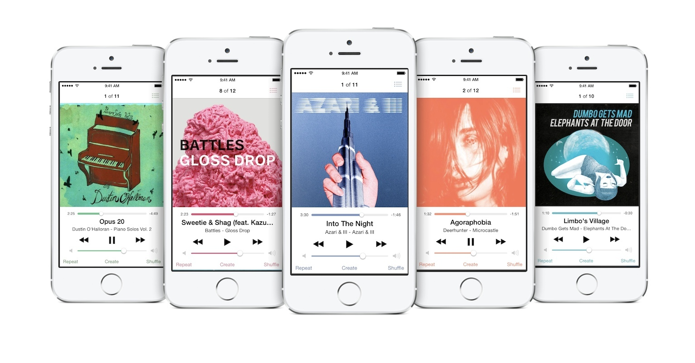

Project Description
=====

UIColor categories and APIs for generating colors. Bring beauty and life into your iOS application.

---

Included is a demo application showing off what these APIs can do for you:

Key colors are grabbed from the album artwork and displayed across the rest of the UI on the currently presented view controller. The app is not fully functional and is for demonstration purposes only.

The code necessary for demo part of application shown above is simple. When the song changes, it calls `refreshColors:` where _iv is the `UIImageView` containing the album art.

	- (void)refreshColors
	{
		UIColor *keyColor = [_iv.image keyColorToContrastAgainstColors:@[[UIColor whiteColor]]
		                                           withMinimumContrast:UIColorContrastLevelLow];
		if ( keyColor ) {
			[[UIApplication sharedApplication] keyWindow].tintColor = keyColor;
		} else {
			UIColor *bg = [_iv.image backgroundColorToContrastAgainstColors:@[[UIColor whiteColor],
			                                                                  [UIColor lightGrayColor]]
			                                            withMinimumContrast:UIColorContrastLevelLow];
			if ( !bg ) bg = [UIColor blackColor];
			[[UIApplication sharedApplication] keyWindow].tintColor = [UIColor neueBlue];
			_trackSlider.tintColor = bg;
			_volumeSlider.tintColor = bg;
		}
	}

This method will search the image for a key-color appropriate color for use on a white background. If a sufficient color is not found, it returns nil. The nil-case is handled by doing a search for a general background-color to contrast against the white background and be different than the light gray color of the maximum slider component (right-side of sliders). The background defaults to black in the rare case no color data is found from image. The background color can be applied to the sliders because there are no key-color requirements. The buttons must have a key color appropriate tint color, so a default blue is used in that situation.

This document is about APIs in development and is subject to change. There are tons of changes, improvements, and simplifications I've been thinking about and may integrate in the future.

Header Descriptions
=====

####`UIColor+Components.h`
This contains methods to get different component values for different colorspaces including RGB, CMYK, HSB, YUV, and CIE-LAB.

---

####`UIColor+ColorFinder.h`
This contains a method to find a color in a set that is most like its receiver.

---

####`UIColor+DeviceColor.h`
This contains methods to get color information about the device, case, app icon, user wallpaper, and more.

---

####`UIColor+KeyColor.h`
This contains a method to see if a color is appropriate for use as a key color (`tintColor` for active controls) as well as a method to find the first key-color-appropriate color in a set. This is useful for finding fallbacks for colors. Can't find a good enough color from an image to use? Fall back to another color and so on.

---

####`UIColor+Manipulation.h`
This contains a method to find the perceived difference in two colors. It uses the CIEDE2000 Color-Difference Formula.

---

####`UIColor+NeueColors.h`
This contains the standard system colors used in Apple's default apps as well as the colors of device hardware.

---

####`UIImage+Colors.h`
This contains methods for getting colors from images. You can specify that you want a general-purpose color or a color to be used as a key color. You can specify if you want to guarantee a specified minimum contrast against another color, which is useful when displaying another color (in button text, for example) against a background color.
